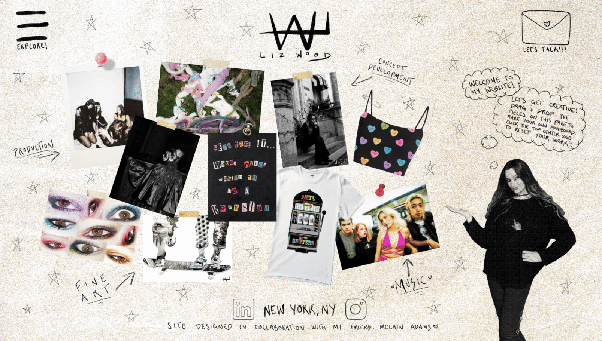

# [lizwood.world](https://lizwood.world)
# Overview
## This site is a corkboard moodboard

## The site can be navigated in many ways

## The site's owner has access to a custom administrative tool where images and accessories can be switched out, repositoned, and stretched. This feature uses Netlify functions and MongoDB to work with React without an arbitrary server

